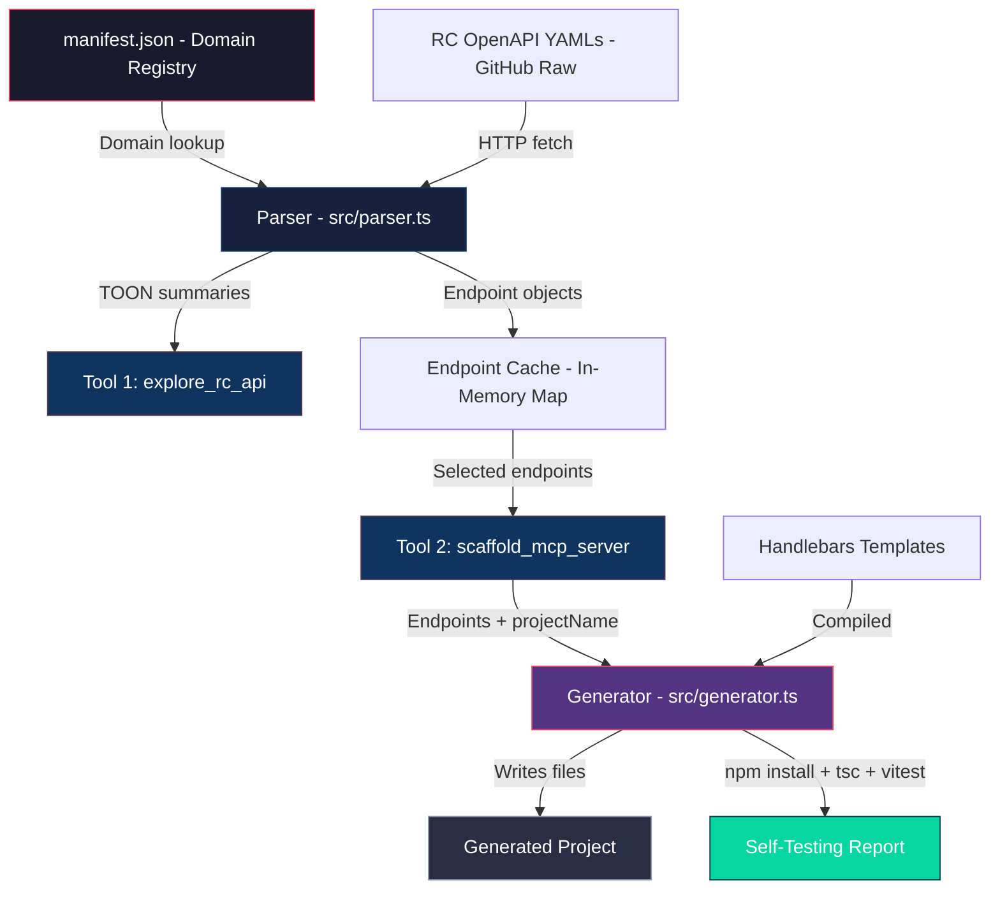

# 🚀 Rocket.Chat Minimal MCP Generator

> **Google Summer of Code 2026 — Rocket.Chat**
> A specialized MCP server generator that surgically extracts functionality from the official Rocket.Chat OpenAPI specifications and scaffolds minimal, production-ready MCP servers — complete with automated test suites.

[](https://nodejs.org/)
[](https://www.typescriptlang.org/)
[](https://modelcontextprotocol.io/)
[](https://opensource.org/licenses/ISC)

---

## 📋 Table of Contents

- [Problem Statement](#-problem-statement)
- [Solution Overview](#-solution-overview)
- [Key Features](#-key-features)
- [Architecture](#-architecture)
- [Two-Tool Orchestration](#-two-tool-orchestration)
- [TOON Compression](#-toon-token-oriented-object-notation)
- [Generated Output Structure](#-generated-output-structure)
- [Templates](#-templates)
- [Getting Started](#-getting-started)
- [Usage Example](#-usage-example)
- [API Domains](#-supported-api-domains)
- [Tech Stack](#-tech-stack)
- [Project Structure](#-project-structure)
- [Contributing](#-contributing)
- [License](#-license)

---

## 🧩 Problem Statement

When AI agents need to interact with large REST APIs like Rocket.Chat (hundreds of endpoints across 12+ domains), they face two critical bottlenecks:

1. **Context Bloat** — Feeding an entire OpenAPI spec into an LLM exhausts the token budget, leading to poor tool-calling accuracy.
2. **Endpoint Hallucination** — Without grounding, LLMs invent API paths that don't exist, causing silent failures in production agentic loops.
3. **Zero Test Coverage** — Manually scaffolded MCP servers rarely include test suites, making regression detection impossible in automated workflows.

## 💡 Solution Overview

The **Minimal MCP Generator** solves all three problems through a **Two-Tool Architecture** that enforces a discovery-before-generation workflow:

```
┌─────────────────────────────────────────────────────────┐
│                   AI Agent / LLM                        │
│   "I need to delete messages and manage roles"          │
└────────────────────┬────────────────────────────────────┘
                     │
        ┌────────────▼────────────┐
        │   Tool 1: explore_rc_api │  ─── Discovers real endpoints
        │   (TOON-compressed)      │      from OpenAPI YAML specs
        └────────────┬────────────┘
                     │  Returns TOON summaries
        ┌────────────▼────────────────┐
        │  Tool 2: scaffold_mcp_server │  ─── Generates full project
        │  (Template-based)            │      with tests & client
        └────────────┬────────────────┘
                     │
        ┌────────────▼────────────────┐
        │  Self-Testing Guarantee      │  ─── npm install → tsc → vitest
        │  (Automated Verification)    │
        └─────────────────────────────┘
```

---

## ✨ Key Features

| Feature | Description |
|---|---|
| **Surgical Extraction** | Never generates a full API wrapper. Identifies the *minimum* set of endpoints for the user's workflow. |
| **TOON Compression** | Reduces verbose JSON schemas to ultra-dense shorthand, saving **~75% of the token budget**. |
| **Two-Tool Architecture** | Separates discovery from generation to eliminate endpoint hallucination. |
| **Zero-Regression Testing** | Every generated tool includes a corresponding Vitest suite with mocked HTTP clients. |
| **Context Protection** | Generated clients feature **8KB payload truncation** and **429 exponential backoff**. |
| **Self-Testing Guarantee** | Post-generation hooks automatically run `npm install` → `tsc --noEmit` → `vitest run`. |

---

## 🏗 Architecture



### Core Modules

| Module | File | Responsibility |
|---|---|---|
| **MCP Server** | `src/index.ts` | Exposes the Two-Tool Architecture via MCP SDK's `StdioServerTransport`. Manages the in-memory endpoint cache between tool calls. |
| **Parser** | `src/parser.ts` | Fetches Rocket.Chat OpenAPI YAML specs from GitHub, dereferences `$ref` pointers, extracts structured `Endpoint[]` objects, and computes TOON compression audit metrics. |
| **Generator** | `src/generator.ts` | The Execution Engine. Compiles 9 Handlebars templates, scaffolds the directory tree, writes all files, and runs the post-generation verification pipeline. |
| **Manifest** | `manifest.json` | Registry of 12 API domains with their OpenAPI source files, keyword matchers, and pre-computed TOON abbreviations. |

---

## 🔀 Two-Tool Orchestration

The architecture enforces a strict **explore → then scaffold** workflow to prevent LLM hallucination of endpoints:

### Tool 1: `explore_rc_api`

```
Input:  { requirement: "I need to delete messages and manage rooms" }
Output: TOON-compressed endpoint summaries + agent instructions
```

**What it does:**
1. Reads `manifest.json` and matches the user's requirement against domain keywords.
2. Fetches the relevant OpenAPI YAML specs from the official [RocketChat-Open-API](https://github.com/RocketChat/Rocket.Chat-Open-API) repository.
3. Parses and dereferences the specs using `@apidevtools/swagger-parser`.
4. Compresses each endpoint into TOON shorthand and caches the structured `Endpoint` objects.
5. Returns the TOON summaries with instructions for the agent to select specific `toolName` strings.

### Tool 2: `scaffold_mcp_server`

```
Input:  { projectName: "rc-cleanup-bot", selectedToolNames: ["post_api_v1_chat_delete", ...] }
Output: Full TypeScript project + Self-Testing Guarantee Report
```

**What it does:**
1. Retrieves only the requested endpoints from the in-memory cache (no hallucinated endpoints can slip through).
2. Compiles Handlebars templates to generate the complete project structure.
3. Runs the post-generation verification pipeline (`npm install` → `tsc --noEmit` → `vitest run`).
4. Returns a structured report with pass/fail status for each verification step.

---

## 🗜 TOON (Token-Oriented Object Notation)

TOON is a custom compression format designed specifically to minimize LLM token consumption when transmitting API schema information.

### Compression Rules

| Full Type | TOON | Savings |
|---|---|---|
| `string` | `s` | 83% |
| `boolean` | `b` | 86% |
| `number` | `n` | 83% |
| `array` | `a` | 80% |
| `integer` | `n` | 86% |

### Parameter Shortcuts

| Full Name | TOON |
|---|---|
| `roomId` | `rid` |
| `msgId` | `mid` |
| `userId` | `uid` |
| `username` | `u` |
| `text` | `m` |

### Transformation Example

**Before (Raw OpenAPI):**
```
POST /api/v1/chat.delete
  requestBody:
    roomId: string (required)
    msgId: string (required)
    asUser: boolean (optional)
```

**After (TOON):**
```
chat.del(rid:s, mid:s, [u:b])
```

The parser also computes a **savings audit**:
```
--- MSG (Savings: 78.3%) ---
- post_api_v1_chat_delete: chat.del(rid:s, mid:s, [u:b])
- post_api_v1_chat_sendMessage: chat.send(rid:s, m:s, [alias:s])
```

---

## 📦 Generated Output Structure

Each generated sub-server follows a standardized architecture:

```
examples/rc-[feature]-bot/
├── src/
│   ├── server.ts         # MCP entry point — dynamically registers all selected tools
│   ├── rc-client.ts      # Token-aware HTTP client with 429 backoff & 8KB truncation
│   └── tools/            # One file per endpoint with Zod input validation
│       ├── post_api_v1_chat_delete.ts
│       └── ...
├── tests/
│   ├── setup.ts          # Global mock environment — intercepts all HTTP calls
│   ├── post_api_v1_chat_delete.test.ts
│   └── ...               # One test file per tool (Zero-Regression Testing)
├── .env.example          # ROCKETCHAT_URL, ROCKETCHAT_AUTH_TOKEN, ROCKETCHAT_USER_ID
├── package.json          # Dependencies: @modelcontextprotocol/sdk, zod, vitest
├── tsconfig.json         # Strict TypeScript configuration
├── vitest.config.ts      # Vitest configuration with setup file
└── README.md             # Auto-generated documentation for the sub-server
```

### Generated File Highlights

#### `rc-client.ts` — Context-Safe HTTP Client
- **8KB Payload Truncation**: Automatically prunes API responses exceeding 8KB to prevent crashing the LLM's context window. Arrays are intelligently truncated to the top 5 items.
- **429 Exponential Backoff**: Retries rate-limited requests up to 3 times with exponential delays, respecting `Retry-After` headers.
- **Flexible Auth**: Supports both username/password login and pre-generated auth token workflows.

#### `tools/*.ts` — Individual API Endpoints
- Each tool exports a standardized object with `name`, `description`, `inputSchema` (Zod), and `handler`.
- Dynamic path interpolation for bracketed URL variables (e.g., `/api/v1/settings/{_id}`).
- TOON header used as the tool description for maximum token efficiency.

#### `tests/*.test.ts` — Zero-Regression Test Suites
Each generated test file validates:
1. ✅ Correct tool name and description export
2. ✅ Zod schema accepts valid arguments
3. ✅ Zod schema rejects missing required arguments
4. ✅ Correct HTTP method, path, and payload forwarding

---

## 🧬 Templates

The generator uses **9 Handlebars templates** — the "DNA" of every generated project:

| Template | Output File | Purpose |
|---|---|---|
| `server.hbs` | `src/server.ts` | MCP server entry with dynamic tool imports and registration |
| `rc-client.hbs` | `src/rc-client.ts` | Token-aware HTTP client with backoff and truncation |
| `tool.hbs` | `src/tools/[name].ts` | Individual endpoint logic with Zod validation |
| `test.hbs` | `tests/[name].test.ts` | Vitest suite for each tool |
| `setup.hbs` | `tests/setup.ts` | Global mock environment for isolated testing |
| `package.hbs` | `package.json` | Project metadata and dependency declarations |
| `tsconfig.hbs` | `tsconfig.json` | Strict TypeScript compiler configuration |
| `vitest.config.hbs` | `vitest.config.ts` | Vitest runner configuration |
| `readme.hbs` | `README.md` | Auto-generated project documentation |

---

## 🚀 Getting Started

### Prerequisites

- **Node.js** v20 or higher
- **npm** (included with Node.js)

### Installation

```bash
# 1. Clone the repository
git clone <repository_url>
cd GSoC

# 2. Install dependencies
npm install

# 3. Start the MCP Architect server
npx tsx src/index.ts
```

### Connecting to Gemini CLI

The project ships as a **Gemini CLI extension**. The `gemini-extension.json` registers the MCP server automatically:

```json
{
  "mcpServers": {
    "rc-master": {
      "command": "npx",
      "args": ["tsx", "${extensionPath}/src/index.ts"],
      "cwd": "${extensionPath}"
    }
  }
}
```

Once installed, Gemini CLI will expose `explore_rc_api` and `scaffold_mcp_server` as native tools.

---

## 🎬 Usage Example

### Prompt
> *"Create a server to manage channel cleanup — deleting old messages, kicking inactive users, and removing stale channels."*

### Step 1: Discovery (explore_rc_api)

The agent calls `explore_rc_api` with the user's requirement. The tool matches against the `msg`, `rooms`, and `integrations` domains, returning:

```
Found domains: [msg, rooms, integrations]

--- MSG (Savings: 78.3%) ---
- post_api_v1_chat_delete: chat.del(rid:s, mid:s, [u:b])
- post_api_v1_chat_sendMessage: chat.send(rid:s, m:s, [alias:s])

--- ROOMS (Savings: 72.1%) ---
- post_api_v1_channels_delete: channels.del(rid:s)
- post_api_v1_channels_kick: channels.kick(rid:s, uid:s)
- get_api_v1_rooms_cleanHistory: rooms.cleanHistory(...)

INSTRUCTION FOR AGENT: Review the TOON headers above. Select the exact
'toolName' strings you need, and pass them as an array to scaffold_mcp_server.
```

### Step 2: Generation (scaffold_mcp_server)

The agent selects the relevant tool names and calls `scaffold_mcp_server`:

```json
{
  "projectName": "rc-cleanup-bot",
  "selectedToolNames": [
    "post_api_v1_chat_delete",
    "post_api_v1_channels_delete",
    "post_api_v1_channels_kick",
    "get_api_v1_rooms_cleanHistory"
  ]
}
```

### Step 3: Self-Testing Guarantee Report

The generator scaffolds the project, installs dependencies, and verifies:

```
Project "rc-cleanup-bot" generated with 4 tools at examples/rc-cleanup-bot.

📁 Generated Test Files:
  - tests/post_api_v1_chat_delete.test.ts
  - tests/post_api_v1_channels_delete.test.ts
  - tests/post_api_v1_channels_kick.test.ts
  - tests/get_api_v1_rooms_cleanHistory.test.ts

🛡️ Self-Testing Guarantee Report:
  npm install:   ✅ Passed
  tsc --noEmit:  ✅ Passed
  vitest run:    ✅ Passed
```

---

## 🌐 Supported API Domains

The `manifest.json` maps **12 Rocket.Chat API domains** to their OpenAPI source files:

| Domain | OpenAPI Source | Keywords | TOON Prefix |
|---|---|---|---|
| **auth** | `authentication.yaml` | login, logout, token, session, 2fa | `auth.ops` |
| **content** | `content-management.yaml` | file, upload, media, download | `cnt.ops` |
| **integrations** | `integrations.yaml` | webhook, script, incoming, outgoing | `int.ops` |
| **marketplace** | `marketplace-apps.yaml` | app, install, uninstall, bundle | `mkt.ops` |
| **msg** | `messaging.yaml` | message, chat, post, react, delete | `msg.ops` |
| **misc** | `miscellaneous.yaml` | info, version, health, shield | `msc.ops` |
| **notify** | `notifications.yaml` | push, email, alert, unread, mention | `ntfy.ops` |
| **omni** | `omnichannel.yaml` | livechat, agent, visitor, queue | `omni.ops` |
| **rooms** | `rooms.yaml` | channel, room, group, invite, join | `rm.ops` |
| **settings** | `settings.yaml` | config, permission, oauth, ldap | `cfg.ops` |
| **stats** | `statistics.yaml` | stat, metric, report, usage | `stt.ops` |
| **users** | `user-management.yaml` | user, status, presence, avatar | `usr.ops` |

All specs are fetched live from the official [RocketChat-Open-API](https://github.com/RocketChat/Rocket.Chat-Open-API) GitHub repository.

---

## 🛠 Tech Stack

| Layer | Technology | Purpose |
|---|---|---|
| **Runtime** | Node.js + TypeScript | Type-safe server execution |
| **Protocol** | MCP SDK (`@modelcontextprotocol/sdk`) | AI tool registration and stdio transport |
| **Validation** | Zod | Runtime input schema validation for generated tools |
| **Templating** | Handlebars | Code generation from `.hbs` template files |
| **Spec Parsing** | `@apidevtools/swagger-parser` + `js-yaml` | OpenAPI YAML dereferencing and parsing |
| **HTTP** | Axios (parser) + Native `fetch` (generated clients) | API spec fetching and generated client requests |
| **Testing** | Vitest | Generated test suites with mocked environments |

---

## 📂 Project Structure

```
GSoC/
├── src/
│   ├── index.ts          # MCP Server — Two-Tool Architecture entry point
│   ├── parser.ts         # OpenAPI YAML parser & TOON compressor
│   └── generator.ts      # Execution Engine — template compilation & project scaffolding
├── templates/
│   ├── server.hbs        # Generated server entry template
│   ├── rc-client.hbs     # HTTP client template (429 backoff + 8KB truncation)
│   ├── tool.hbs          # Individual tool endpoint template
│   ├── test.hbs          # Vitest test suite template
│   ├── setup.hbs         # Test environment mock setup template
│   ├── package.hbs       # package.json template
│   ├── tsconfig.hbs      # TypeScript config template
│   ├── vitest.config.hbs # Vitest config template
│   └── readme.hbs        # Generated README template
├── examples/             # Generated sub-servers (output directory)
│   ├── rc-cleanup-bot/
│   ├── rc-admin-dashboard-mcp/
│   └── rc-stats-server/
├── manifest.json         # API domain registry (12 domains)
├── gemini-extension.json # Gemini CLI extension configuration
├── CONTEXT.md            # Project history & architectural decisions
├── GEMINI.md             # AI system prompt & SOPs
├── package.json          # Root project dependencies
└── tsconfig.json         # Root TypeScript configuration
```

---

## ⚠️ Constraints & Guardrails

- **No Hallucinations**: Only endpoints discovered from the official [RocketChat-Open-API](https://github.com/RocketChat/Rocket.Chat-Open-API) specs can be generated. The cache-based architecture makes it structurally impossible to scaffold an endpoint that wasn't first explored.
- **Token Efficiency**: TOON compression ensures payload minimization. The generated HTTP client enforces 8KB truncation.
- **Security**: Credentials are never hardcoded. All auth flows use `process.env` configurations via `.env` files.
- **Error Handling**: Every generated tool catches `401 Unauthorized` and `403 Forbidden` responses and returns human-readable MCP error messages.

---

## 🤝 Contributing

1. Fork the repository
2. Create a feature branch (`git checkout -b feature/amazing-feature`)
3. Commit your changes (`git commit -m 'Add amazing feature'`)
4. Push to the branch (`git push origin feature/amazing-feature`)
5. Open a Pull Request

### Development

```bash
# Run the Architect server in development
npx tsx src/index.ts

# Run an example generated server
cd examples/rc-cleanup-bot
npm install
npm start

# Run generated tests
npm test
```

---

## 📄 License

This project is licensed under the ISC License. See the [LICENSE](LICENSE) file for details.

---

<p align="center">
  Built with ❤️ for <strong>Google Summer of Code 2026</strong> × <strong>Rocket.Chat</strong>
</p>
